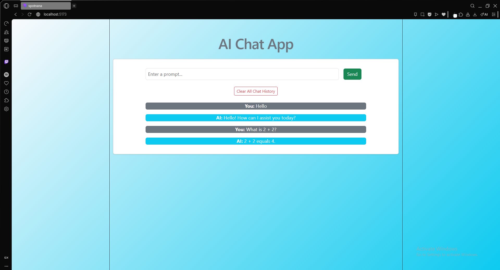
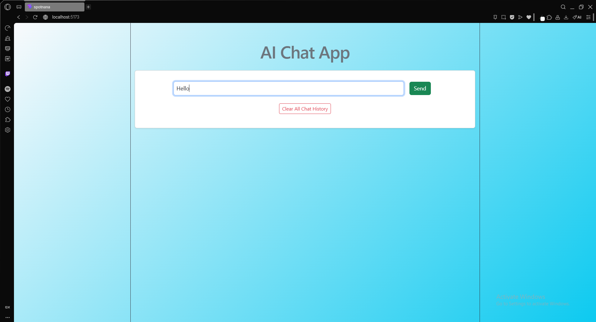
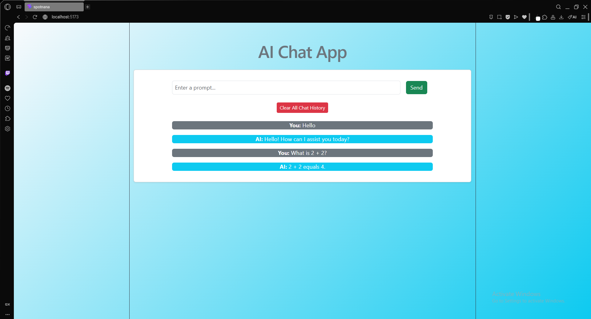
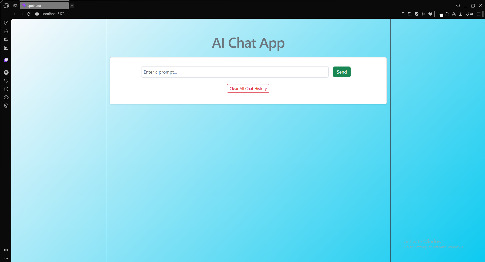

# SpotnanaAssessment
A small react app that uses OpenAI to return responses from user's input. Can be fully accessed from this URL: https://spotnanaassessmentfrontend.onrender.com

Simply type in the prompt you want and the AI will respond back.

It does persist on reloading the page or when you close and come back, so if you want a new chat you can hit the "Clear all chat history" button to remove the chat.

Before:

After:

